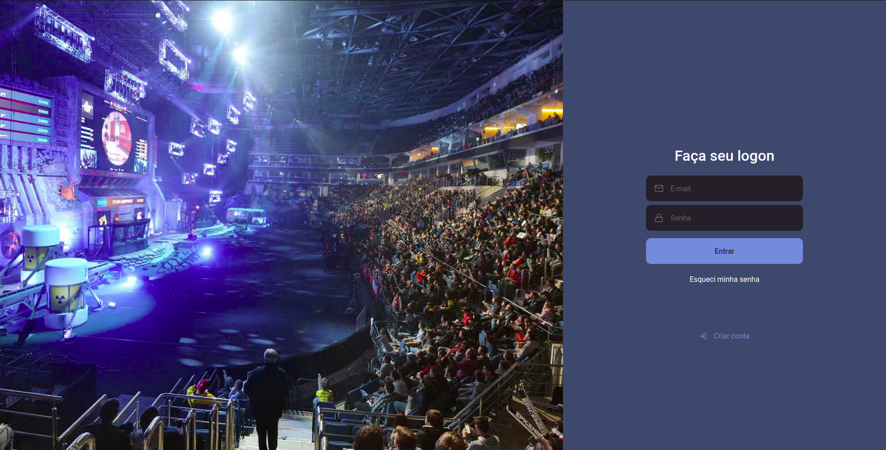
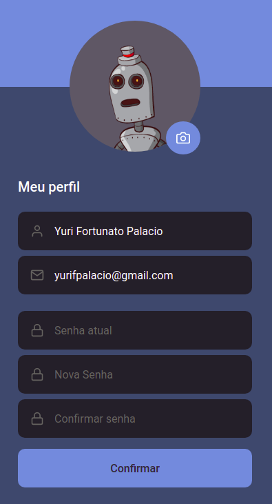
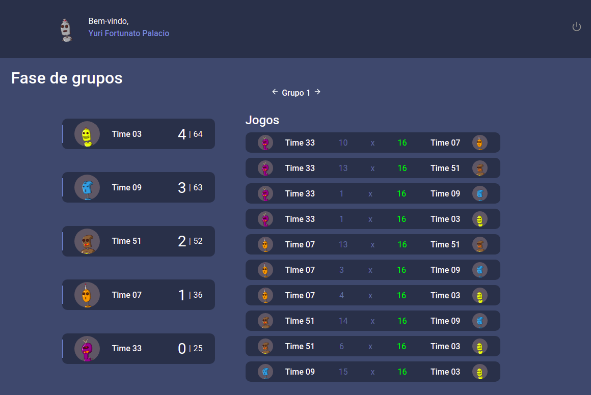
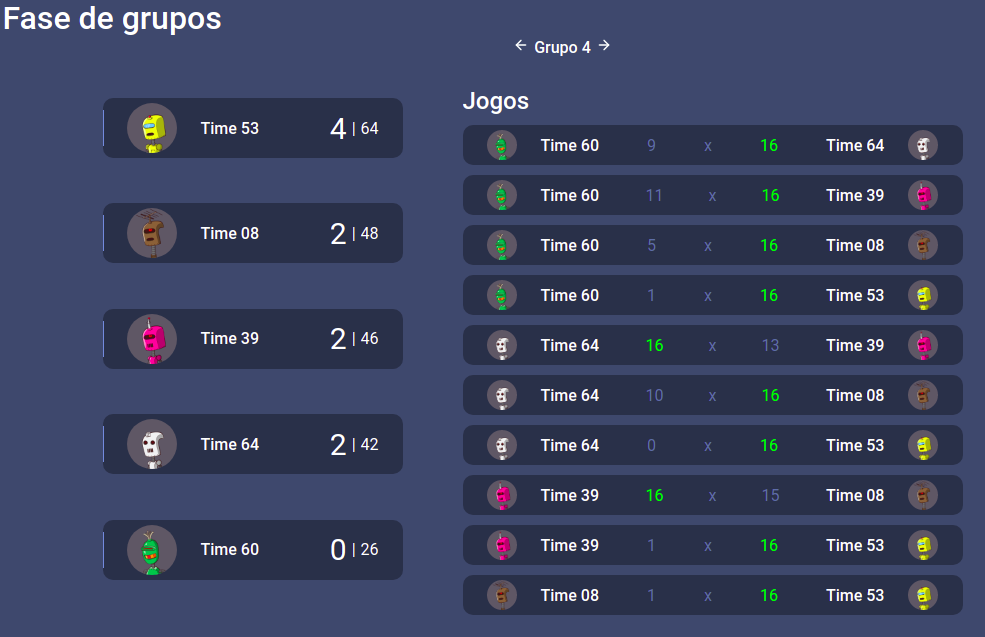
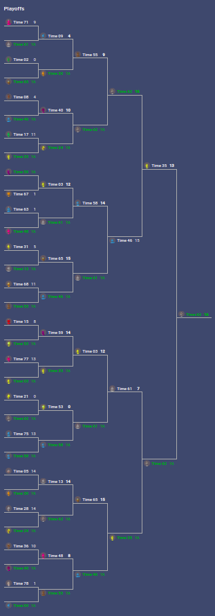

<h1 align="center">
	Championships Creator
</h1>

<p align="center">	
  

  <a href="https://www.linkedin.com/in/yuripalacio/">
    
  </a>
  
  <a href="https://github.com/yuripalacio/championships-creator/commits/master">
    
  </a>
  
  <a href="https://github.com/yuripalacio/mychat/blob/master/LICENSE">
    
  </a>
</p>

<p align="center">
  <a href="#projeto">Projeto</a>&nbsp;&nbsp;&nbsp;|&nbsp;&nbsp;&nbsp;
  <a href="#tecnologias">Tecnologias</a>&nbsp;&nbsp;&nbsp;|&nbsp;&nbsp;&nbsp;
  <a href="#como-usar">Como Usar</a>&nbsp;&nbsp;&nbsp;|&nbsp;&nbsp;&nbsp;
  <a href="#licença">Licença</a>
</p>

# 💻Projeto

O projeto Championships Creator foi desenvolvido para demonstrar meus conhecimentos e potencial de crescimento.
É um projeto completo com backend (API), Aplicação Web.
<br /><br />
Na Aplicação Web é possível realizar um cadastro de um usuário com algumas informações básicas como Nome, E-mail e Senha.
<br />
<h1 align="center">
  
</h1>
Ao realizar esse cadastro, será criado de forma automática no backend um torneio assim como seus respectivos times e jogos.
<br />
Meu objetivo nesse projeto foi realizar toda a automatização na geração do torneio com a finalidade de tornar prático para o usuário sem a necessidade de seeds ou que o usuário tenha de criar todas essas etapas.
<br />
Para cada usuário criado no sistema será criado um torneio diferente e com possíveis resultados diferentes.
<br />
<h1 align="center">
  
</h1>
<br />
Todo torneio que for criado pela aplicação terá 80 times.<br />
Em uma primeira fase denominado Fase de Grupos os times são separados em grupos com 5 times cada.<br />
<h1 align="center">
  
  
</h1>
Esses times são selecionado de forma randômica assim como o resultado de cada partida.<br />
Será classificado para a próxima fase os 2 melhores times de cada grupo. Essa classificação é feito selecionando os times que tiveram mais vitórias e em um eventual empate é utilizado os rounds a favor obtidos por cada time.
<br />
Com isso, teremos 32 times que irão se enfrentar nos Playoff no estilo mata-mata até obtermos o time vencedor.
<br />
<h1 align="center">
  
</h1>

# 🛠Tecnologias

### Server (API)
* [Node.JS](https://nodejs.org/en/docs/)
* [TypeScript](https://www.typescriptlang.org/)
* [Express](https://expressjs.com/)
* [ProstgreSQL](https://www.postgresql.org/)
* [Multer](https://www.npmjs.com/package/multer)
* [Cors](https://github.com/expressjs/cors)
* [Celebrate](https://www.npmjs.com/package/celebrate)

### Web
* [ReactJS](https://reactjs.org/)
* [TypeScript](https://www.typescriptlang.org/)
* [Axios](https://github.com/axios/axios)
* [Ethereal](https://ethereal.email/)

#  🚀Como Usar

Para usar a aplicação, você precisa de [Git](https://git-scm.com), [Node.js][nodejs] e [Yarn][yarn] instalado no seu computador. Com as ferramentas instaladas, basta seguir os passos a seguir:

### Clonar o projeto

```bash
# Clonar o projeto do repositório
$ git clone https://github.com/yuripalacio/championships-creator
```

### Server (API) 

```bash
# Entre na pasta backend
$ cd championships-creator/back_end

# Instale as dependências
$ yarn
```
### Banco de Dados (API)
No desenvolvimento utilizei o docker para subir meu banco.<br />
```bash
# Crie o banco de dados (ProstgreSQL) no Docket
$ docker run --name championshipscreator -e POSTGRES_PASSWORD=docker -p 5432:5432 -d postgres

# Para iniciar o banco caso necessário
$ docker start championshipscreator

# Executar as migrations
$ yarn typeorm migration:run

# Executa o servidor no endereço localhost a porta 3333
$ yarn dev:server
```

### Web

```bash
# Entre na pasta web
$ cd championships-creator/back_end

# Instale as dependências
$ yarn

# Execute a aplicação web. A aplicação será aberta no endereço localhost na porta 3000
$ yarn start
```
## Licença

Esse projeto está sob a licença MIT. Veja o arquivo <a href="https://github.com/nathaliacristina20/gorestaurant/blob/master/LICENSE">LICENSE</a> para mais detalhes.

By [Yuri Palacio](https://www.linkedin.com/in/palacio/)

[nodejs]: https://nodejs.org/
[typescript]: https://www.typescriptlang.org/
[expo]: https://expo.io/
[reactjs]: https://reactjs.org
[rn]: https://facebook.github.io/react-native/
[yarn]: https://yarnpkg.com/
